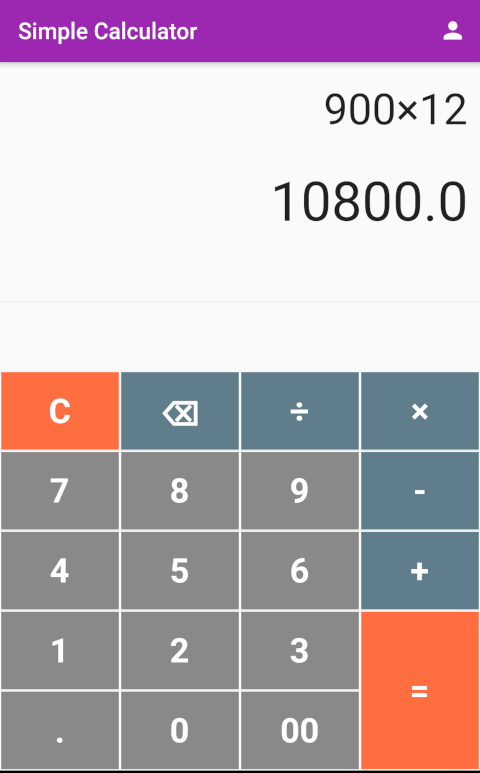

# Simple Calculator (calculator_ristek)

Athal's first program in Flutter, made for Oprec Ristek Fasilkom UI 2021.

## Screenshots

<table>
  <tr>
    <td>Homepage</td>
     <td>About Me Page</td>
  </tr>
  <tr>
    <td></td>
    <td></td>
  </tr>
 </table>

## References

These following are the references I used for creating the program.

- [How to Create a Beautiful Simple & Scientific Calculator in Flutter - YouTube](https://www.youtube.com/watch?v=l4bLPfS1uik)
- [Navigate between screens in Flutter | by Pete Houston | Medium](https://medium.com/@petehouston/navigate-between-screens-in-flutter-8c4c21084e73)
- [Flutter UI Tutorial - Designing Profile Page UI Design in Your App](https://www.youtube.com/watch?v=vw1vBM0wbzQ)
- [dart - How to load images with image.file - Stack Overflow](https://stackoverflow.com/questions/49835623/how-to-load-images-with-image-file)
- [FlatButton class - material library - Dart API](https://api.flutter.dev/flutter/material/FlatButton-class.html)
- [Build and release an Android app - Flutter](https://flutter.dev/docs/deployment/android#build-an-apk)
